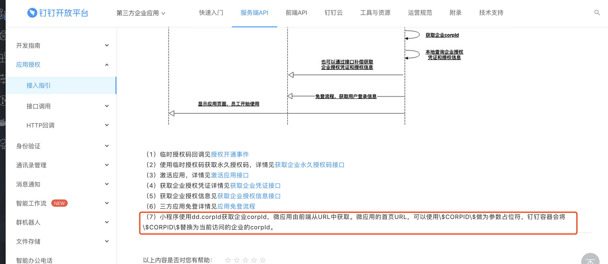
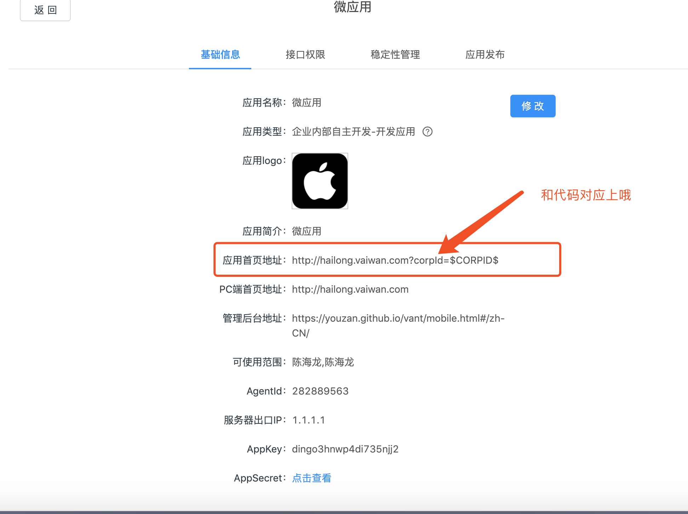
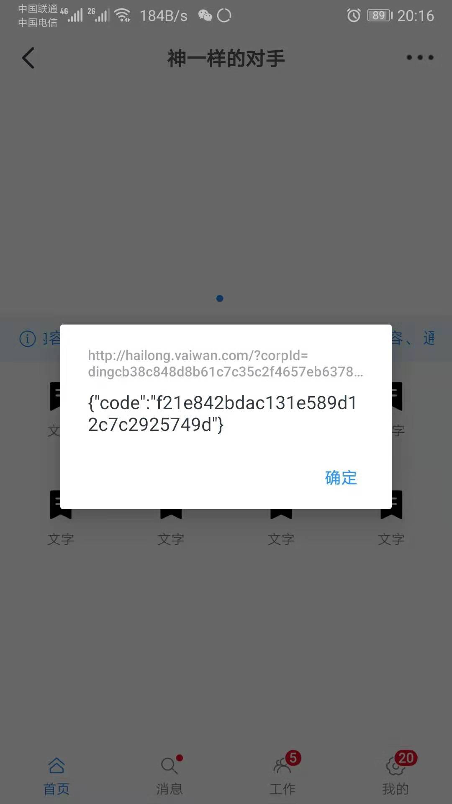

<!--
 * @version: v0.0.1
 * @Author: hailong.chen
 * @Date: 2019-10-11 13:51:59
 * @LastEditors: hailong.chen
 * @LastEditTime: 2019-10-11 20:21:46
 * @Descripttion: 
 -->
 
### 该项目由PC更改，UI适用移动端UI，能否根据url链接选取pc端还是移动端渲染


### 该项目可以实现，移动端web渲染，不适用PC端


### 该项目切换页面，相同页面多次进栈，导致，返回连续不断


### 解决corpId作为参数获取授权code
- 技术群（把我往坑里带，我就不截图了）
- (开发者文档链接)[https://ding-doc.dingtalk.com/doc#/serverapi3/hwd30h]
- 文档参考

 - 应用配置

- 获取url参数代码
  ```js
  // ../utils/getUrlParam
    function getUrlParam(name){
        var reg = new RegExp("(^|&)"+ name +"=([^&]*)(&|$)");
        var r = window.location.search.substr(1).match(reg);
        if (r!=null) return unescape(r[2]); return null;
    }
  ```
- app获取
```js
import dd from 'dingtalk-jsapi';
import getUrlParam from '../utils/getUrlParam';

dd.ready(() => {
  const corpId = getUrlParam('corpId');
  alert(corpId);
  // dd.ready参数为回调函数，在环境准备就绪时触发，jsapi的调用需要保证在该回调函数触发后调用，否则无效。
  dd.runtime.permission.requestAuthCode({
    // corpId: 'dingcb38c848d8b61c7c35c2f4657eb6378f',
    corpId,
    onSuccess(result) {
      alert(JSON.stringify(result));
      /* {
            code: 'hYLK98jkf0m' //string authCode
        } */
    },
    onFail(err) {
      alert(JSON.stringify(err));
    },

  });
});

```
- 文档截图
- 
  

